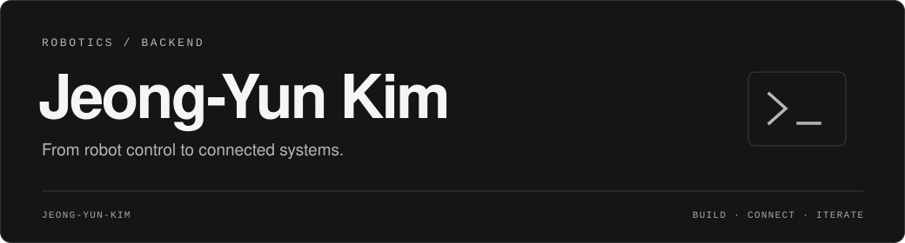

  

### 로봇을 움직이고, 데이터를 연결하는 개발자 김정윤입니다.

ROS 2 기반 로봇 제어와 컴퓨터 비전, 서버 개발을 중심으로 프로젝트를 만들고 있습니다.  
센서에서 얻은 정보가 로봇의 동작으로 이어지고, 그 결과가 서버와 화면에 연결되는 과정을 구현합니다.

 

## Focus

- **Robotics** · 로봇팔 제어, 작업 시퀀스, ROS 2 기반 장비 연동
- **Vision** · 카메라와 객체 인식을 활용한 로봇 작업 자동화
- **Backend** · API, 실시간 상태 모니터링, 로봇과 서비스 연결

 

## Selected Projects

| Project | What I build |
| :--- | :--- |
| **[Mirobot ROS 2](https://github.com/Jeong-Yun-Kim/Mirobot_ros2)** | ROS 2와 YOLO를 활용한 로봇팔 제어 및 비전 기반 픽앤플레이스 |
| **[Smart Factory Server](https://github.com/Jeong-Yun-Kim/mirobot_order_server)** | FastAPI·WebSocket으로 주문부터 로봇 작업, 배송까지 연결하는 공정 서버 |
| **[UWB Communication](https://github.com/Jeong-Yun-Kim/UWB_Test)** | ESP32·DWM1000으로 노트북과 Jetson 간 텍스트·이미지를 주고받는 통신 실험 |

 

## Tech Stack

**Languages**  
`Python` `C++`

**Robotics & Vision**  
`ROS 2` `OpenCV` `YOLO`

**Backend & Tools**  
`FastAPI` `WebSocket` `Linux` `Git` `PlatformIO`

 

## GitHub Activity

  

  
  

  GitHub에 공개된 활동 기준 · 커밋 시간대: KST (UTC+9)

 

---

  <b>LET’S CONNECT</b> 
  <a href="mailto:jeongyun061030@gmail.com">jeongyun061030@gmail.com</a>
  &nbsp;·&nbsp;
  <a href="https://github.com/Jeong-Yun-Kim?tab=repositories">Explore repositories</a>

